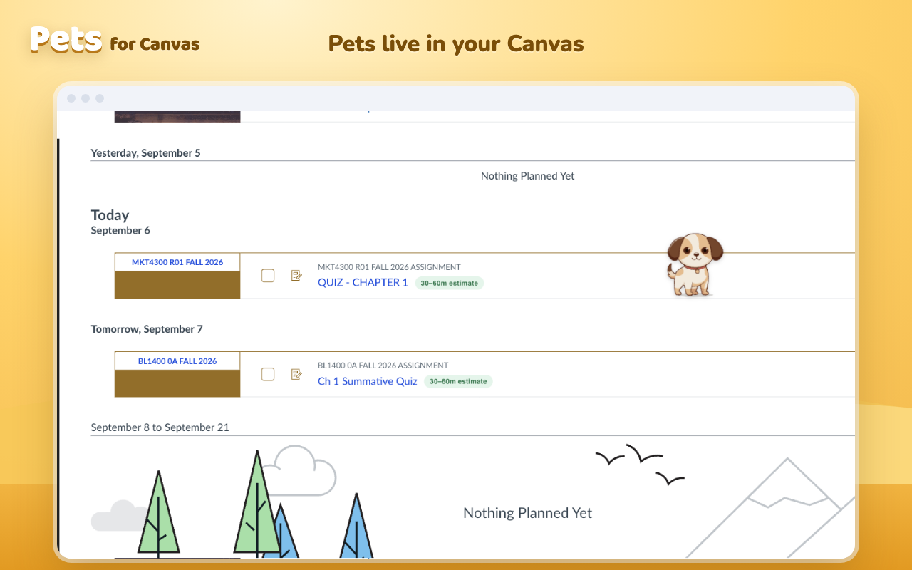

# Pets for Canvas

A pet that lives in your Canvas. Chrome extension, free, no login.

Install: https://chromewebstore.google.com/detail/pets-for-canvas/cgmbkkaalodhmfadjcnolihhomgkdpbc



Made by a Michigan Tech student. Winston Digital LLC. Built with AI assistance; the product, the design decisions, the art direction and the economy are mine.

## What it does

A pet walks around your Canvas pages. It gets happy when you submit, sad when something is overdue, and sleeps at night. Finish what is due each day and your streak grows. Streaks pay coins, coins buy collars and new animals.

## What leaves your browser

Every outbound request the extension makes is in one file: `extension/network.js`. There is nothing else. In short:

- The API receives an anonymous device id plus the game events it needs to keep your balance honest: an assignment id when you submit, a milestone day count, shop actions, and anything you type into the feedback box.
- Your own Canvas is read on your logged-in session for overdue state, and one private entry is written to your Canvas custom data so your pet follows your Canvas login across devices. Nothing is ever posted, submitted or changed in your courses.
- No names, no grades, no messages, no page contents, no browsing history.

Full policy: https://canvas-digest-production.up.railway.app/privacy

## Layout

- `extension/` — the extension as shipped (MV3). `content.js` detects completion moments, `streak.js` keeps the streak, `economy.js` turns events into earn requests, `pet.js` is the pet, `popup.*` is the hub, `network.js` is the only file that talks to the network.
- `backend/` — FastAPI service. The ledger is server-authoritative: prices, ownership, box odds and streak payouts live in `backend/ledger.py`. Nothing the client stores can change a balance.
- `tools/` — store package build (`build-store-zip.sh`), rig builders for the animals, the test bench, the admin inbox reader.
- `docs/` — privacy policy and the animal/collar test benches.

## Verify what is running

- Store package: `tools/build-store-zip.sh` builds the zip from this repo. Each release is tagged (`v1.0.8`) and the tag message carries the zip's sha256. Unzip the store copy and diff it against a local build.
- Server: `GET https://canvas-digest-production.up.railway.app/version` returns the commit the running API was deployed from (`tools/deploy.sh` sets it). The API is hosted on Railway and operated by Winston Digital LLC.

## Run it

Dev copy: `chrome://extensions` → Developer mode → Load unpacked → `extension/`. It points at the production API.

Backend locally:

```
python3 -m venv .venv && .venv/bin/pip install -r backend/requirements.txt
.venv/bin/uvicorn backend.app:app --reload --port 8971
```

The store package is built only by `tools/build-store-zip.sh`: it flips the dev flag, strips dormant code and every comment, and fails if any network call exists outside `network.js`.

## Contributing

Bug reports and security reports are welcome (see `SECURITY.md`). Pull requests are not being taken yet.

## License

Code: Apache-2.0. Art and name: see `ART-LICENSE.md`.
